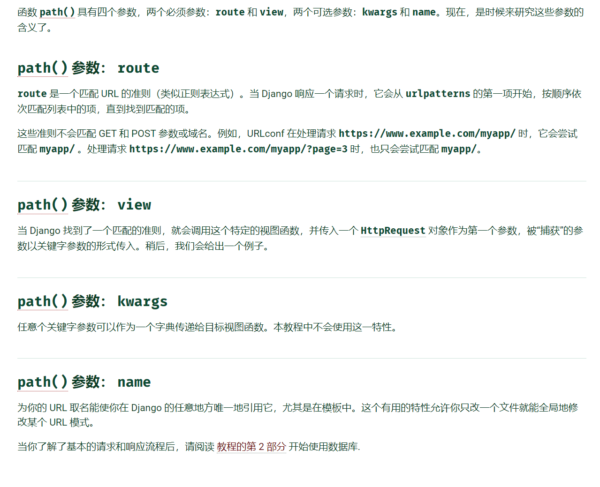

### Django 介绍


#### 创建 Django 项目

```
从命令行，cd进入您要存储代码的目录，然后运行以下命令：
> django-admin startproject mysite
```

##### 目录结构与介绍

```
mysite/ 	--项目的容器,可随意命名
    manage.py 	--命令行实用程序，可以各种方式与此 Django 项目进行交互
    mysite/ 	--项目的实际 Python 包。它的名称是 Python 包名称
        __init__.py 	--告诉 Python 这个目录应该被认为是一个 Python 包
        settings.py		--配置
        urls.py			--Django 驱动站点的“目录”
        asgi.py			--兼容 ASGI 的 Web 服务器的入口点，可为您的项目提供服务。
        wsgi.py			--WSGI 兼容的 Web 服务器的入口点，用于为您的项目提供服务。
```

##### 函数介绍

```
path(route, view, kwargs=None, name=None)

```



##### 一些常用命令

```
# 迁移数据库，将项目中原有的模型迁移到指定数据库中
python manage.py migrate
# 为新建模型 创建一个迁移文件   后可加 XXX 指模型名，需在setting 中配置
python manage.py makemigrations 
# 然后再执行迁移数据库命令

```

