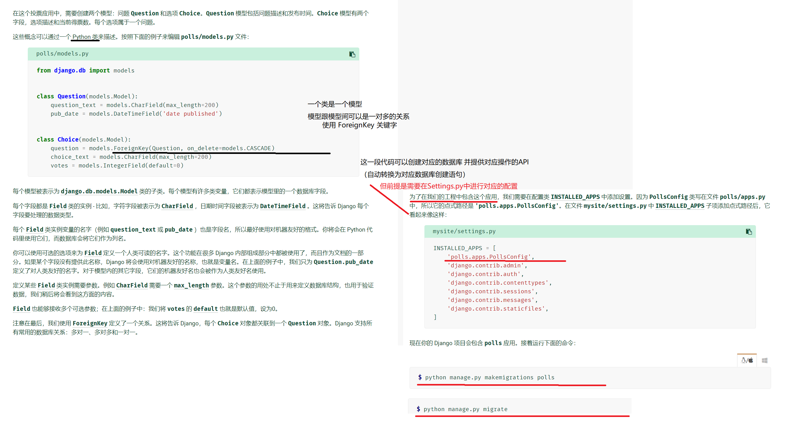

### Django 介绍


#### 安装并配置 Django 

请随便找个教程 ——————


#### 创建 Django 项目

```
从命令行，cd进入您要存储代码的目录，然后运行以下命令：
> django-admin startproject mysite
```

##### 目录结构与介绍

```
mysite/ 	--项目的容器,可随意命名
    manage.py 	--命令行实用程序，可以各种方式与此 Django 项目进行交互
    mysite/ 	--项目的实际 Python 包。它的名称是 Python 包名称
        __init__.py 	--告诉 Python 这个目录应该被认为是一个 Python 包
        settings.py		--配置
        urls.py			--Django 驱动站点的“目录”
        asgi.py			--兼容 ASGI 的 Web 服务器的入口点，可为您的项目提供服务。
        wsgi.py			--WSGI 兼容的 Web 服务器的入口点，用于为您的项目提供服务。
```

##### 函数介绍

```
path(route, view, kwargs=None, name=None)
	route:  匹配URL的准则 -- 不会匹配GET和POST参数	--必要
	view:	调用特定的试图函数，并传入HttpRequest对象作为首个参数(被捕获的参数一关键字形式传入) --必要
	Kwargs:	任意个关键字可作为字典传递给目标视图函数
	name：	为当前URL取名，并可在该Django项目中任意使用
```

##### 一些常用命令/流程

```
# 运行
python manage.py runserver

# 生成数据库，将项目中原有的模型迁移到指定数据库中
python manage.py migrate
# 为新建模型 创建一个迁移文件   后可加 XXX 指模型名，需在setting 中配置
python manage.py makemigrations 
# 然后再执行数据库生成命令

# 创建投票(polls)应用(APP) -- 项目中可有多个应用
python manage.py startapp polls

# 编辑可见效果视图
from django.http import HttpResponse


def index(request):
    return HttpResponse("Hello, world. You're at the polls index.")
    
# 在APP目录下创建URLS.py文件 并添加路由
from django.urls import path

from . import views

urlpatterns = [
    path('', views.index, name='index'),
]

# 在根Urls.py 中添加路径
from django.contrib import admin
from django.urls import include, path

urlpatterns = [
    path('polls/', include('polls.urls')),
    path('admin/', admin.site.urls),
]
```


##### 关于创建 -- 模型/数据库 



